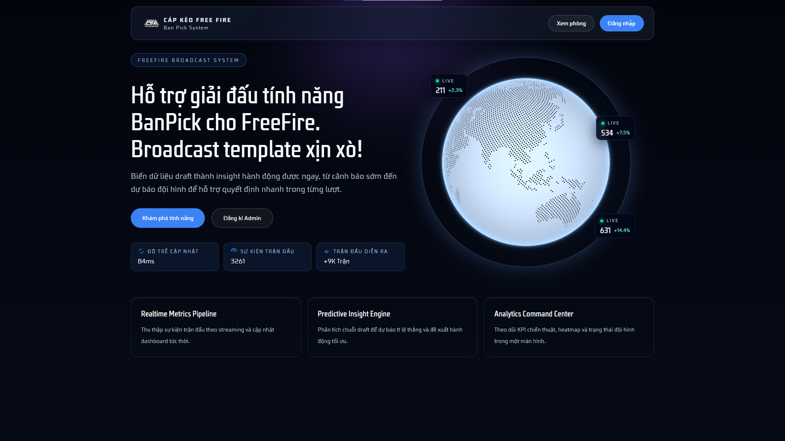

# 📝 FreeFire Ban Pick System
<div align="center">
  <p><i>Hệ thống quản lý ban/pick cho Free Fire tích hợp Redis và Docker</i></p>
</div>



---

**Tác giả:** [@iamdinhduchuy](https://github.com/iamdinhduchuy) 

---

Hệ thống quản lý ban/pick cho Free Fire gồm hai phần:

- `backend`: API Express/TypeScript, Sequelize, SQLite, JWT auth, Morgan logging
- `frontend`: Next.js, TypeScript, Tailwind CS S 4, giao diện Cosmic với globe và header glass

## Định hướng phát triển

- Tích hợp `Redis` cho phần realtime để có thể ổn định
- Tích hợp `Docker` để build và deploy dễ dàng hơn
- Thêm tính năng quản lý user (phân quyền, reset password, v.v.)
- Cải thiện UI/UX với các hiệu ứng động và responsive design

## Tính năng chính

- Đăng nhập bằng JWT
- Khóa các API `GET user` cho tài khoản `admin`
- Tạo user với mật khẩu được hash
- Giao diện homepage theo phong cách Analytics/Cosmic
- Trang rooms có tìm kiếm, popup và các khối thông tin tương tác
- Cấu trúc backend theo mô hình MVC

## Công nghệ

- Next.js 16
- React 19
- TypeScript
- Tailwind CSS 4
- Express 5
- Sequelize
- SQLite
- JSON Web Token

## Cấu trúc dự án

```text
.
├── backend/
├── frontend/
└── README.MD
```

## Chạy dự án

### 1. Backend

```bash
cd backend
npm install
cp .env.example .env
npm run dev
```

### 2. Frontend

```bash
cd frontend
npm install
npm run dev
```

## Biến môi trường backend

Tạo file `.env` trong thư mục `backend` dựa trên `.env.example`.

- `PORT`: cổng chạy API
- `SQLITE_STORAGE`: tên file SQLite
- `JWT_SECRET`: secret để ký JWT

## API chính

- `POST /api/auth/login`: đăng nhập và nhận JWT
- `POST /api/users`: tạo user mới
- `GET /api/users`: lấy danh sách user, yêu cầu quyền admin
- `GET /api/users/:id`: lấy chi tiết user, yêu cầu quyền admin

## Ghi chú

- Token JWT hiện không đặt thời hạn hết hạn tự động.
- Cơ sở dữ liệu SQLite sẽ được đồng bộ khi backend khởi động.
